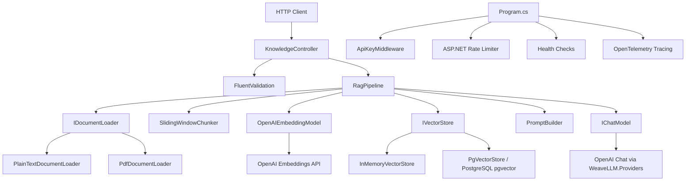

# KnowledgeLLM — Internal Architecture Notes

> Generated from a repository scan on 27 June 2026. This file is intended as internal implementation documentation and complements the public README.

## System Purpose

KnowledgeLLM is a .NET 8 Retrieval-Augmented Generation (RAG) HTTP API. It indexes local `.txt` and `.pdf` documents into vector storage, retrieves the most relevant chunks for a question, and uses WeaveLLM/OpenAI chat completion to produce source-grounded answers.

## Runtime Projects

| Project | Responsibility |
|---|---|
| `src/KnowledgeLLM.Api` | ASP.NET Core host, controllers, validation, middleware, rate limiting, health checks, Swagger, logging, tracing setup. |
| `src/KnowledgeLLM.Core` | RAG domain pipeline, document loaders, chunking, embedding client, vector stores, DI registration, prompt construction. |
| `tests/KnowledgeLLM.Core.Tests` | Unit/integration tests for loaders, chunking, embeddings, retrieval, pipeline, API boundary behavior, health checks, and middleware. |

## Request Surface

All RAG endpoints are exposed by `KnowledgeController` under `/api/knowledge`.

| Endpoint | Method | Purpose | Rate-limit policy |
|---|---|---|---|
| `/api/knowledge/index` | `POST` | Load documents from a file or directory, chunk them, embed them, and upsert chunks into the configured vector store. | `index-limit` |
| `/api/knowledge/ask` | `POST` | Embed a question, retrieve top-K chunks, build a RAG prompt, and return a blocking answer plus sources. | `ask-limit` |
| `/api/knowledge/ask/stream` | `POST` | Same retrieval path as `/ask`, then stream chat tokens as Server-Sent Events. | `ask-limit` |

Health endpoints are available at `/health/live`, `/health/ready`, and `/health`.

## Indexing Flow

```text
IndexRequest.Source
  -> KnowledgeController.IndexAsync
  -> RagPipeline.IndexAsync
  -> IDocumentLoader.LoadAsync
       - PlainTextDocumentLoader for .txt
       - PdfDocumentLoader for .pdf
       - CompositeDocumentLoader when PDF support is enabled
  -> ITextChunker.ChunkAsync
       - SlidingWindowChunker
  -> IEmbeddingModel.EmbedBatchAsync
       - OpenAIEmbeddingModel using named HttpClient "openai-embeddings"
  -> IVectorStore.UpsertAsync
       - InMemoryVectorStore by default
       - PgVectorStore when KnowledgeLLM:PgVector:Enabled=true
  -> IndexResponse { chunksIndexed, source }
```

Failure handling is stage-oriented: every stage returns `ChainResult<T>`. `RagPipeline.IndexAsync` short-circuits on the first failure and propagates the error code/message to the controller.

## Query Flow

```text
AskRequest.Question + AskRequest.TopK
  -> KnowledgeController.AskAsync / AskStreamAsync
  -> RagPipeline.AskAsync / AskStreamAsync
  -> IEmbeddingModel.EmbedAsync(question)
  -> IVectorStore.SearchAsync(queryEmbedding, topK)
  -> PromptBuilder.BuildRagPrompt(question, sources)
  -> IChatModel.ChatAsync(...) or IChatModel.StreamChatSafeAsync(...)
  -> RagAnswer { answer, sources } or SSE data tokens
```

`PromptBuilder` instructs the model to answer only from retrieved context and to say clearly when the answer is not present.

## Component Interaction Diagram



## Storage Modes

| Mode | Configuration | Persistence | Notes |
|---|---|---|---|
| In-memory | Default (`PgVector.Enabled=false`) | Process lifetime only | Best for local demos/tests; state is lost on restart. |
| PostgreSQL/pgvector | `PgVector.Enabled=true` plus connection string | Durable | Initializes schema lazily on first vector-store operation. |

## Observability

The API host configures Serilog request logging and OpenTelemetry tracing. `ServiceCollectionExtensions.PipelineActivitySourceName` is the activity source for pipeline traces. In development, traces are exported to console; outside development, OTLP export is configured.

## Important Implementation Rules Captured From the Codebase

- Use `WeaveLLMError` factory methods for structured errors.
- Use type aliases around WeaveLLM model/provider types in files that reference them to avoid namespace collisions.
- Use `IHttpClientFactory`; do not instantiate raw long-lived `HttpClient` instances directly for provider clients.
- Preserve cancellation-token plumbing through async methods.
- Keep OpenAI API keys out of committed configuration; use user secrets or environment variables.
