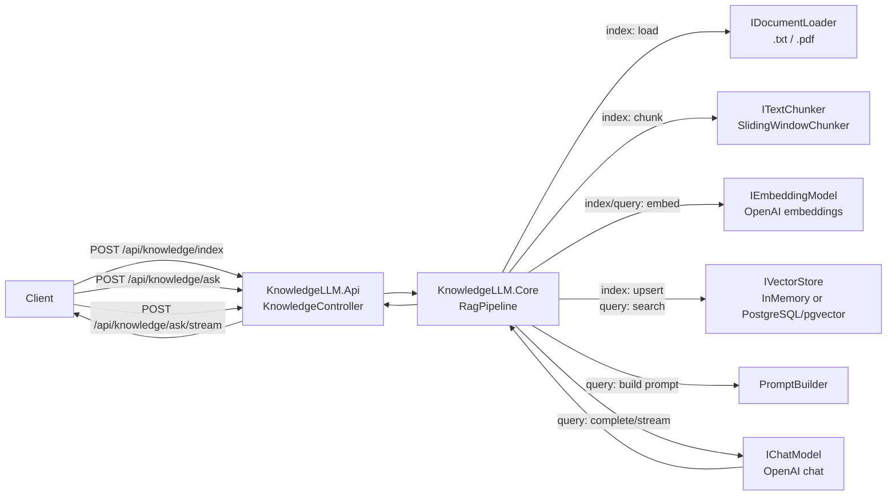
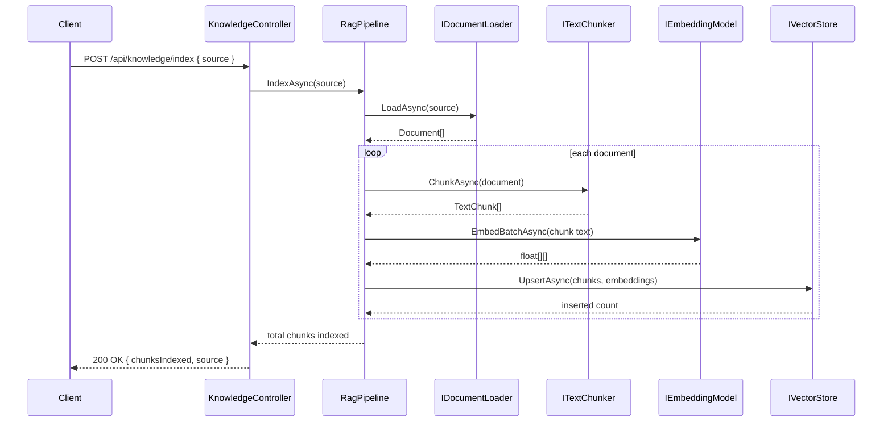
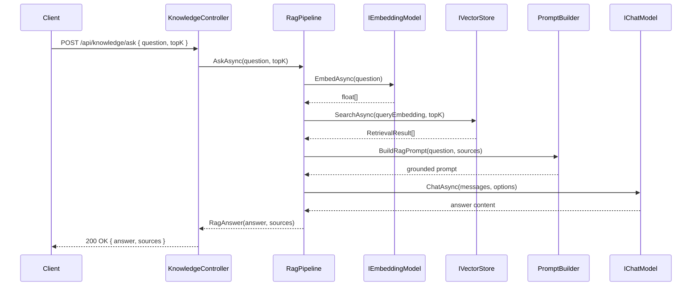

# KnowledgeLLM Architecture

KnowledgeLLM is a .NET 8 Retrieval-Augmented Generation (RAG) API. The API layer exposes document indexing and question-answering endpoints, while the core layer owns document loading, chunking, embedding, vector storage, prompt construction, and LLM calls.

## Runtime Components

| Component | Responsibility |
|---|---|
| `KnowledgeController` | HTTP boundary for `/api/knowledge/index`, `/api/knowledge/ask`, and `/api/knowledge/ask/stream`. It maps pipeline results to API responses and error payloads. |
| `RagPipeline` | Orchestrates indexing and query execution. Each stage returns a `ChainResult<T>` and the pipeline short-circuits on the first failure. |
| `IDocumentLoader` | Loads supported source documents from a file or directory. `PlainTextDocumentLoader` handles `.txt`; `CompositeDocumentLoader` can combine text and PDF loading. |
| `ITextChunker` | Splits each loaded document into overlapping `TextChunk` instances using `SlidingWindowChunker`. |
| `IEmbeddingModel` | Calls OpenAI embeddings for document chunks and user questions. |
| `IVectorStore` | Stores and searches vectors. The application can use `InMemoryVectorStore` for local development or `PgVectorStore` for PostgreSQL/pgvector persistence. |
| `PromptBuilder` | Formats retrieved chunks and the user question into a grounded RAG prompt. |
| `IChatModel` | Uses WeaveLLM's OpenAI chat provider for regular and streaming answer generation. |

## Component Interaction Diagram

## Indexing Flow

The indexing flow ingests a local source path and persists searchable chunk embeddings.

1. **Validate input**: `RagPipeline.IndexAsync` rejects a null, empty, or whitespace `source` value.
2. **Load documents**: The configured `IDocumentLoader` reads the source path.
   - A single `.txt` file is loaded by `PlainTextDocumentLoader`.
   - When PDF support is registered, `CompositeDocumentLoader` dispatches `.txt` and `.pdf` files to the appropriate loader.
   - Directories are loaded recursively for supported file types.
3. **Chunk documents**: Each `Document` is split by `SlidingWindowChunker` according to configured chunk size and overlap.
4. **Embed chunks**: `OpenAIEmbeddingModel.EmbedBatchAsync` converts chunk text into embedding vectors.
5. **Persist vectors**: `IVectorStore.UpsertAsync` stores each chunk and embedding pair.
   - `InMemoryVectorStore` keeps vectors in process memory.
   - `PgVectorStore` initializes its schema on first use and persists rows to PostgreSQL with pgvector.
6. **Return count**: The API returns the total number of chunks indexed for the request.

## Query Flow

The query flow retrieves relevant chunks, builds a grounded prompt, and asks the chat model to answer from the retrieved context.

1. **Validate input**: `RagPipeline.AskAsync` rejects blank questions and requires `topK >= 1`.
2. **Embed question**: `IEmbeddingModel.EmbedAsync` converts the user question into a query vector.
3. **Search vector store**: `IVectorStore.SearchAsync` performs similarity search and returns the top matching chunks.
4. **Handle empty retrieval**: If no sources are found, the pipeline returns a `NOT_FOUND` error instead of asking the model to answer without context.
5. **Build grounded prompt**: `PromptBuilder.BuildRagPrompt` combines the user question with retrieved source chunks.
6. **Generate answer**:
   - `/api/knowledge/ask` calls `IChatModel.ChatAsync` and returns one response payload with `answer` and `sources`.
   - `/api/knowledge/ask/stream` calls the streaming chat path and emits Server-Sent Events until `[DONE]` or an error token.

## Configuration and Storage Selection

`AddKnowledgeLLM` registers the core services and binds settings from the `KnowledgeLLM` configuration section. Storage is selected at startup:

- `KnowledgeLLM:PgVector:Enabled = false` uses `InMemoryVectorStore`.
- `KnowledgeLLM:PgVector:Enabled = true` uses `PgVectorStore` with `KnowledgeLLM:PgVector:ConnectionString` and the configured embedding dimensions.

This allows the same pipeline to run in lightweight local mode or in persistent PostgreSQL-backed mode without changing controller code.

## Observability and Reliability Boundaries

- The API applies request validation, optional API-key middleware, fixed-window rate limiting, health checks, and Serilog request logging.
- `RagPipeline` creates OpenTelemetry activities for index, load, chunk, embed, upsert, ask, search, and completion stages.
- The pipeline records latency histograms for indexing (`knowledgellm.indexing.duration`), retrieval (`knowledgellm.retrieval.duration`), and LLM response generation (`knowledgellm.llm_response.duration`) so operators can compare ingestion, vector-search, and model-call performance.
- Pipeline stages fail fast with structured `ChainResult<T>` errors; later stages are not invoked after an upstream failure.
